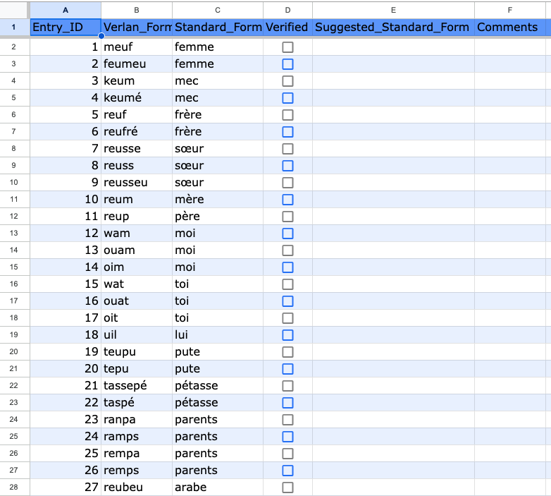
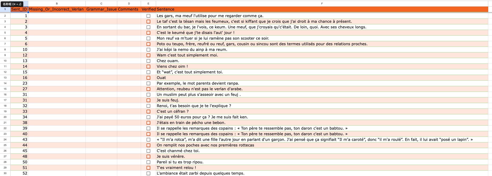

# Appel à annotateurs natifs – **Verlan français**

Nous recrutons des locuteurs natifs de français pour **vérifier** notre jeu de données sur le verlan (projet Univ. of Otago).  
Le dataset ressemble aux captures ci-dessus : une feuille « lexique » (paires *verlan → français standard*) et une feuille « phrases » (phrases contenant du verlan).

## Ce que vous recevrez
- **60** entrées *verlan ↔ forme standard* (feuille « Lexique »).  

- **60** phrases avec au moins un verlan (feuille « Phrases »).

## Votre tâche (repérage d’erreurs)
**Feuille Lexique**
- Cocher **Verified** si la paire est correcte.
- Sinon, proposer la **forme standard** correcte et/ou une **variante orthographique**, et laisser un **commentaire** si utile.

**Feuille Phrases**
- Signaler tout **verlan manquant ou incorrect**.
- Indiquer éventuellement un **problème grammatical**.
- Cocher **Verified** quand la ligne est finalisée.

> Objectif : repérer et corriger les erreurs, rien de plus.  
> Participation **bénévole** (non rémunérée). Plus de détails dans les PDF.

## Avant de commencer
Merci de **lire attentivement** les deux documents PDF ci-joints (réf. éthique **2025/1116**) :
1. [*Information Sheet for Adult Participants or Parents-Guardians*](https://github.com/greateden/Verlan-Annotation/blob/main/Info%20Sheet.pdf)
2. [*Consent Form for Participants*](https://github.com/greateden/Verlan-Annotation/blob/main/Consent%20Form.pdf)

## Comment participer
1. **Signez** le *Consent Form* (signature manuscrite ou électronique).  
2. **Renvoyez** le PDF signé par e-mail à : **eden.li@otago.ac.nz**.  
3. **Indiquez** l’adresse e-mail **associée à votre compte Google** (celle utilisée pour Google Sheets).  
4. Nous vous partagerons alors les deux feuilles (60 + 60) et vous pourrez commencer l’annotation.

⚠️ **Merci de compléter votre annotation dès que possible après réception des fichiers.** Votre réactivité nous aide à finaliser rapidement le dataset.
